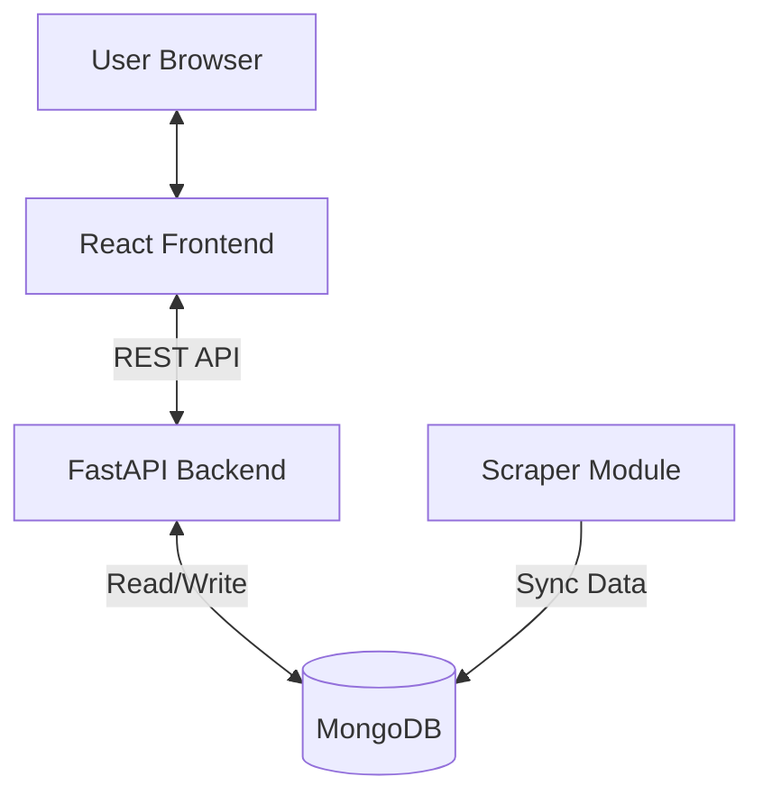

# PhoneWise – Smart Phone Recommendation & Comparison Platform

PhoneWise is a premium full-stack web application designed to help users find their perfect smartphone. By combining a powerful AI-driven scoring engine with a beautiful, modern user interface, PhoneWise simplifies the complex task of smartphone shopping.

---

## 🚀 Key Features

- **Intelligent Recommendations**: A sophisticated algorithm that ranks phones based on user priorities (Camera, Battery, Performance, Storage, RAM), budget constraints, and OS preferences.
- **Explainable AI**: Every recommendation comes with a "Why this phone?" explanation, highlighting exactly which of your priorities the device matches best.
- **Side-by-Side Comparison**: A detailed, real-time comparison engine to see technical specifications of two devices head-to-head.
- **Dynamic Scoring**: Match percentages calculated using normalized feature scores and weighted user preferences.
- **Premium Design System**: A state-of-the-art "Glassmorphism" dark theme built with Vanilla CSS, featuring smooth micro-animations and a responsive layout.
- **Automated Data Sourcing**: Includes a dedicated scraper module to keep the device database fresh with the latest specs.

---

## 🛠️ Technology Stack

- **Frontend**:
  - React 18 (Vite)
  - Vanilla CSS (Custom Design System)
  - React Router DOM
  - Axios
- **Backend**:
  - FastAPI (Python 3.10+)
  - Pydantic V2 (Data Validation)
  - MongoDB (Database)
- **Scraper**:
  - Requests + BeautifulSoup4
  - Automated Upsert Logic

---

## 🏗️ High-Level Architecture



---

## 📂 Project Structure

```text
PhoneWise/
├── backend/            # Python FastAPI Application
│   ├── app/
│   │   ├── main.py            # API Routes & Entrypoint
│   │   ├── models.py          # Data Schemas (Pydantic)
│   │   ├── recommendation.py  # Scoring Algorithm
│   │   ├── db.py              # MongoDB Connection
│   │   └── config.py          # App Configuration
│   └── .env                   # Environment Variables
├── frontend/           # React + Vite Application
│   ├── src/
│   │   ├── pages/             # Home, Recommend, Compare
│   │   ├── components/        # Navbar, Footer, PhoneCard
│   │   ├── App.jsx            # Main Layout & Routes
│   │   ├── main.jsx           # Vite Entrypoint
│   │   └── index.css          # Premium Design System
│   └── package.json
├── scraper/            # Data Collection Module
│   └── scrape_phones.py       # Phonedb.net Scraper
└── README.md
```

---

## ⚙️ Getting Started

### 1. Backend Setup
1. Navigate to the backend folder: `cd backend`
2. Create a virtual environment: `python -m venv venv`
3. Activate the environment: `source venv/bin/activate` (Linux/Mac) or `venv\Scripts\activate` (Windows)
4. Install dependencies: `pip install -r requirements.txt`
5. Configure your `.env` file with `MONGO_URI`.
6. Start the server: `uvicorn app.main:app --reload`

### 2. Frontend Setup
1. Navigate to the frontend folder: `cd frontend`
2. Install dependencies: `npm install`
3. Start the development server: `npm run dev`
4. Open the app at `http://localhost:5173`

### 3. Data Population (Optional)
To populate your database with real phone data, run the scraper:
```bash
PYTHONPATH=. python -m scraper.scrape_phones
```
Or use the `/update-database` API endpoint (requires secret token).

---

## 🧠 How the Algorithm Works

The recommendation engine calculates a **Match Score** using the following steps:
1. **Normalization**: Phone features (Battery, RAM, Price, etc.) are normalized against the entire dataset to a 0-1 scale.
2. **Weighted Sum**: The user's 1-10 priority sliders are converted into weights.
3. **Primary Use Heuristics**: If a user selects a primary use case (e.g., Gaming), the algorithm applies additional emphasis on performance and thermal-related specs.
4. **Percentage Calculation**: The final score is mapped to a percentage to provide a clear compatibility metric to the user.

---

## 🎨 Design Philosophy

PhoneWise follows a **Premium Aesthetic** philosophy:
- **Depth**: Using glassmorphism (backdrop-filters and subtle borders) to create layers.
- **Motion**: Subtle CSS animations (`animate-fade-in`, floating badges) to make the UI feel alive.
- **Clarity**: High-contrast typography and color-coded match badges for instant information parsing.

---

© 2026 PhoneWise Development Team. All Rights Reserved.
